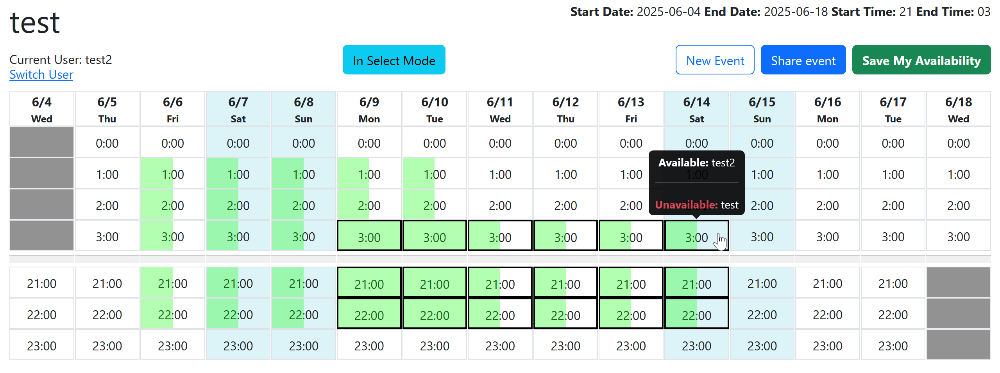

# Event scheduler app

I wanted a self hosted version of when2meet while making some (imo) ui improvments. 

I totally vibe coded this in like 2 days so run at your own risk. I do have the full power of gitlab's security suite aimed at this and it seems to be alright. 

Try it here:

https://scheduler.quickbrownfoxes.org/



### Docker deployment
you'll first need to `touch /home/vincent/scheduler/events.db` and `chown 1000:1000 events.db`
```
services:
  scheduler:
    container_name: scheduler
    image: registry.gitlab.com/quickbrownfoxes/scheduler
    environment:
      - WEB_DOCUMENT_INDEX=index.html
    volumes:
      - /home/vincent/scheduler/events.db:/app/events.db
```

### Regular fpm deployment
Permissions required to run this app. 

Where `82` is the userid of your fpm process!

```
chown :82 scheduler
chmod 775 scheduler
```

```
vincent@3:~/webapps/scheduler$ ls -la
total 128
drwxrwxr-x 3 vincent      82  4096 May 26 03:58 .
```